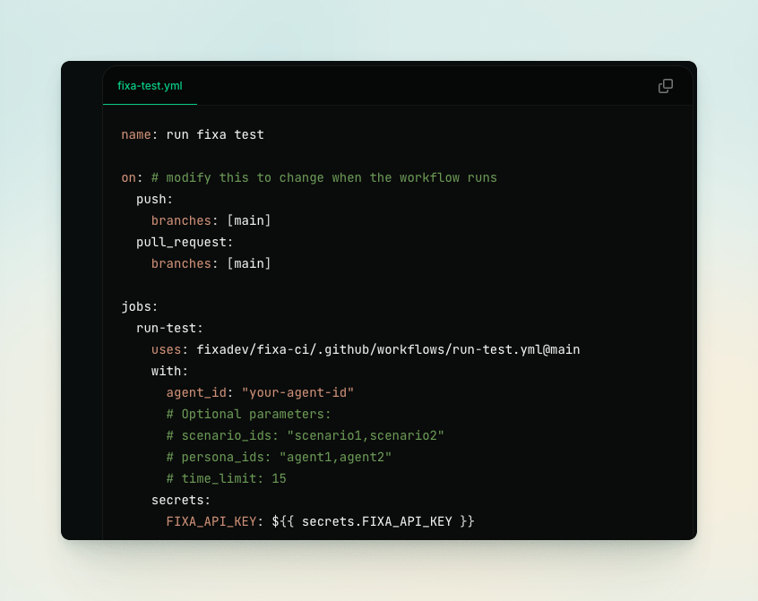

[](https://fixa.dev)

<h3 align="center">
  <a href="https://docs.fixa.dev">📘 Docs</a>
  | <a href="https://fixa.dev/">☁️ Cloud Platform</a>
  | <a href="https://discord.gg/rT9cYkfybZ">🎮 Discord</a>
</h4>

# fixa: open-source testing and observability for voice agents

fixa helps you run simulated tests, analyze production calls, fix bugs in your voice agents. oh, and we're fully open source.

get started for free with our cloud platform - no demos, no commitments, only pay for what you use.

<div align="center">

</div>

## ✨ Features

|                                                                                                                                        |                                                                              |
| -------------------------------------------------------------------------------------------------------------------------------------- | :--------------------------------------------------------------------------: |
| **Automated Testing**<br>Our voice agents call your voice agents to catch issues before they reach production                          |          |
| **Deploy with Peace of Mind**<br>Integrate seamlessly into your CI/CD pipeline using our prebuilt github action, API, or SDK           |           |
| **Monitor Production Calls**<br>Analyze latency, interruptions, and custom evals                                                       |  |
| **Measure What Matters**<br>Create evaluations to validate specific conversation flows and edge cases                                  |     |
| **Catch Issues Instantly**<br>Slack alerts notify you immediately if evaluations fail in production or latency thresholds are exceeded |              |

## 📦 self-hosting

### local development

1. clone this repo
2. copy `.env.example` to `.env` for apps/web-app, apps/node-server, apps/transcription-service and packages/db and fill in the required values
3. install dependencies:

```sh
pnpm i
```

4. run the app

```sh
pnpm dev
```

### production deployment

1. apps/web-app is deployed on vercel
   a. the easiest way to deploy is to create a vercel account and connect to your github account / fork of this repo.
   b. make sure to set the environment variables in vercel to match the values in .env.example.
   c. set root directory to 'apps/web-app'
   d. set framework to 'next.js'
   e. set build command to 'cd ../.. && pnpm vercel-build'
   f. set install command to 'pnpm install'

2. apps/node-server and apps/transcription-service are deployed on fly.io. so the easiest way to deploy is to create a fly.io account, create an app for apps/node-server and apps/transcription-service on fly.io, add the environment variables to the apps using the fly.io dashboard, and deploy using the github action in .github/workflows/fly-deploy.yml.

3. if you cannot use fly.io, you can deploy the apps with infrastructure of your choice using the Dockerfile in each app directory.
