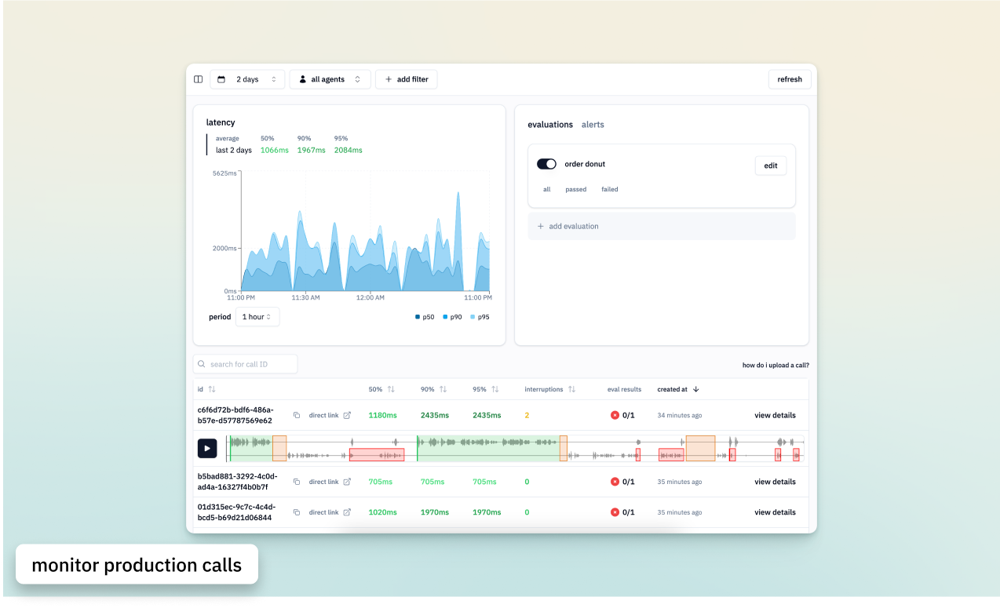
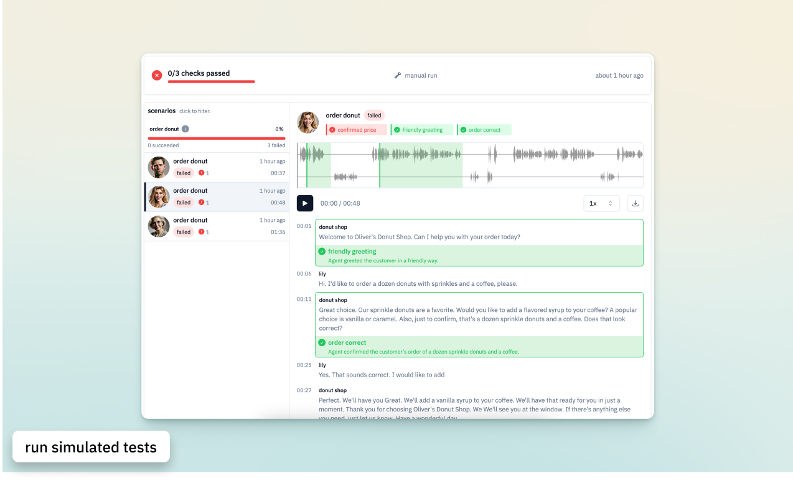
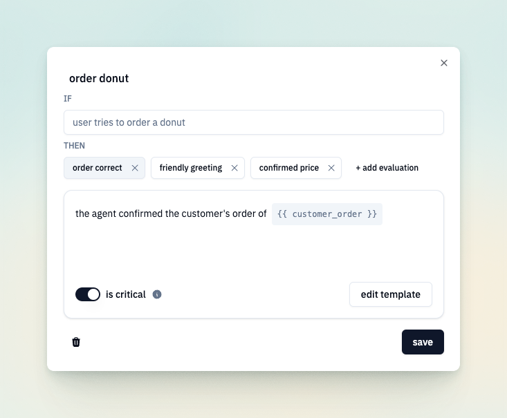
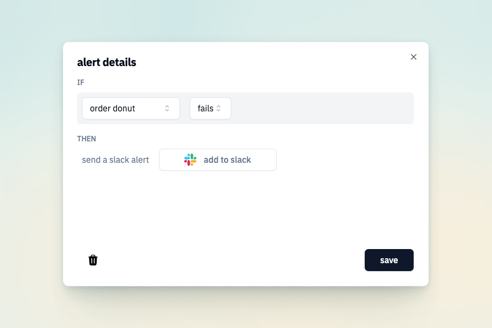

[](https://fixa.dev)

<h3 align="center">
  <a href="https://docs.fixa.dev">📘 Docs</a>
  | <a href="https://fixa.dev/">☁️ Cloud Platform</a>
  | <a href="https://demo.fixa.dev/">✨ Demo</a>
  | <a href="https://discord.fixa.dev">🎮 Discord</a>
</h4>

# fixa: open-source testing and observability for voice agents

fixa helps you run simulated tests, analyze production calls, fix bugs in your voice agents. oh, and we're fully open source.

get started for free with our cloud platform - no demos, no commitments, only pay for what you use.

<div align="center">

</div>

## ✨ Features

|                                                                                                                                          |                                                                              |
| ---------------------------------------------------------------------------------------------------------------------------------------- | :--------------------------------------------------------------------------: |
| <h3>automated testing</h3> our voice agents call your voice agents to catch issues before they reach production                          |          |
| <h3>deploy with peace of mind</h3> integrate seemlessly into your CI/CD pipeline using our prebuilt github action, API, or SDK           |          |
| <h3>monitor production calls</h3> analyze latency, interruptions, and custom evals                                                       |  |
| <h3>measure what matters</h3> create evaluations to validate specific conversation flows and edge cases                                  |     |
| <h3>catch issues instantly</h3> slack alerts notify you immediately if evaluations fail in production or latency thresholds are exceeded |              |

<!-- ## 📦 Installation & Setup

1. Create an account at [fixa.dev](https://fixa.dev)
2. Install the Fixa SDK:
   ```bash
   npm install @fixa/sdk
   # or
   yarn add @fixa/sdk
   ```
3. Configure your API key:

   ```typescript
   import { FixaClient } from "@fixa/sdk";

   const fixa = new FixaClient({
     apiKey: "your_api_key_here",
   });
   ```

4. Start testing:
   ```typescript
   await fixa.test.create({
     name: "My First Test",
     type: "voice",
     phoneNumber: "+1234567890",
   });
   ```

For detailed setup instructions and examples, visit our [documentation](https://docs.fixa.dev). -->
