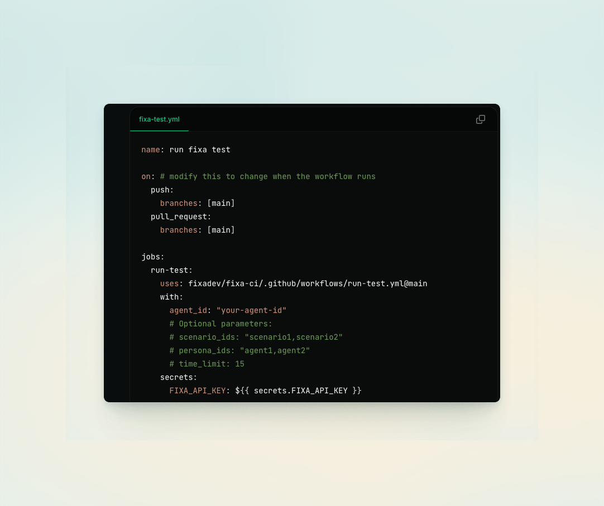

[](https://fixa.dev)

<h3 align="center">
  <a href="https://docs.fixa.dev">📘 Docs</a>
  | <a href="https://fixa.dev/">☁️ Cloud Platform</a>
  | <a href="https://discord.gg/rT9cYkfybZ">🎮 Discord</a>
</h4>

# fixa: open-source testing and observability for voice agents

fixa helps you run simulated tests, analyze production calls, fix bugs in your voice agents. oh, and we're fully open source.

get started for free with our cloud platform - no demos, no commitments, only pay for what you use.

<div align="center">

</div>

## ✨ Features

|                                                                                                                                        |                                                                              |
| -------------------------------------------------------------------------------------------------------------------------------------- | :--------------------------------------------------------------------------: |
| **Automated Testing**<br>Our voice agents call your voice agents to catch issues before they reach production                          |          |
| **Deploy with Peace of Mind**<br>Integrate seamlessly into your CI/CD pipeline using our prebuilt github action, API, or SDK           |           |
| **Monitor Production Calls**<br>Analyze latency, interruptions, and custom evals                                                       |  |
| **Measure What Matters**<br>Create evaluations to validate specific conversation flows and edge cases                                  |     |
| **Catch Issues Instantly**<br>Slack alerts notify you immediately if evaluations fail in production or latency thresholds are exceeded |              |

## 📦 self-hosting

### local development

1. clone this repo
2. copy `.env.example` to `.env` for apps/web-app, apps/node-server, apps/transcription-service and packages/db and fill in the required values
3. install dependencies:

```sh
pnpm i
```

4. run the app

```sh
pnpm dev
```

### Production Deployment

#### 1. Web App (Vercel)

- Create a Vercel account and connect to your GitHub account/fork
- Set environment variables to match `.env.example`
- Configure build settings:
  - Root Directory: `apps/web-app`
  - Framework: Next.js
  - Build Command: `cd ../.. && pnpm vercel-build`
  - Install Command: `pnpm install`

#### 2. Backend Services (Fly.io)

The node-server and transcription-service can be deployed on Fly.io:

- Create a Fly.io account
- Create separate apps for `apps/node-server` and `apps/transcription-service`
- Add environment variables via Fly.io dashboard
- Deploy using the GitHub Action in `.github/workflows/fly-deploy.yml`

#### 3. Alternative Deployment

If you prefer not to use Fly.io, you can deploy the backend services using your preferred infrastructure - each app directory contains a Dockerfile for containerized deployment.
